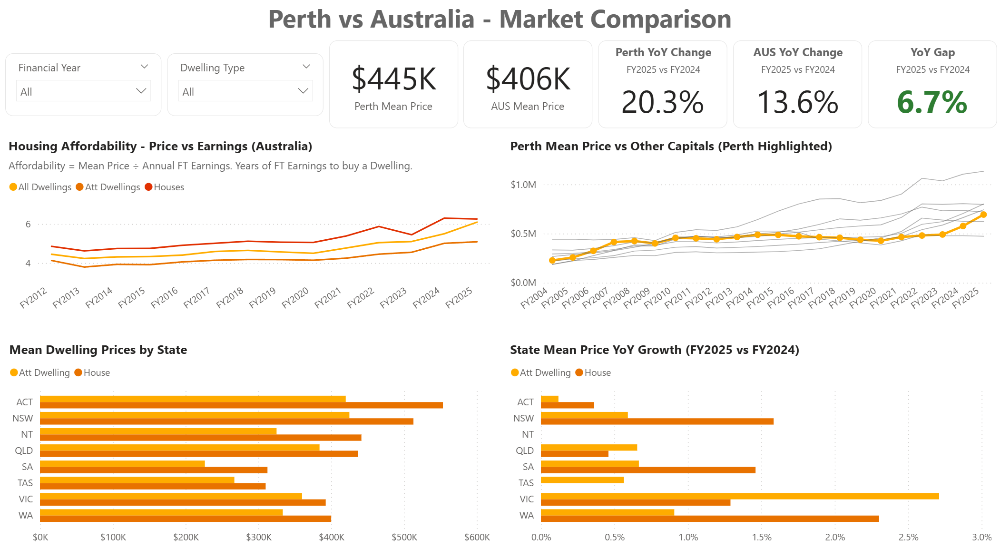
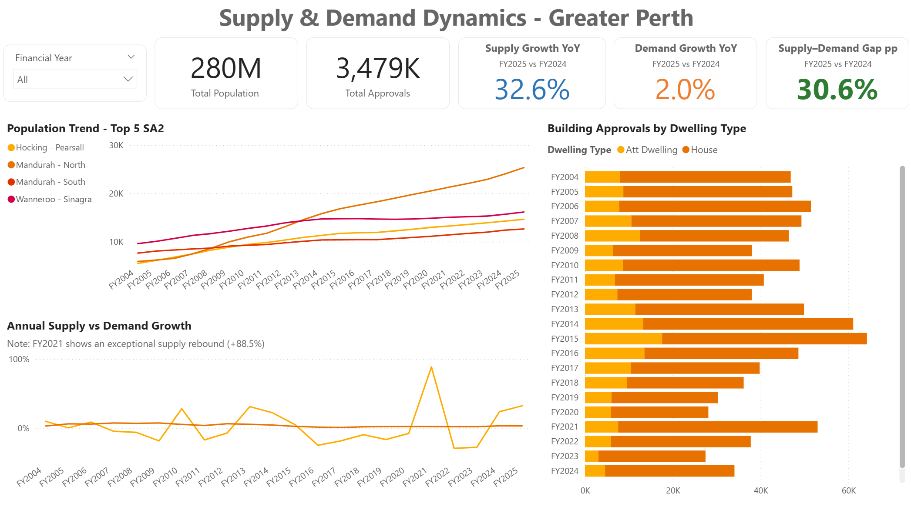

# Perth Property Insights (SQL + Power BI)

## 📊 Overview

This project analyses housing trends in Perth, Western Australia using a structured SQL data model and an interactive Power BI dashboard.

The objective is to explore:

* Property price trends over time
* Supply vs demand (building approvals vs population growth)
* Housing affordability relative to earnings
* Geographic differences across suburbs

---

## 🧱 Data Model

The project is built using a **star schema** with multiple fact tables connected to shared dimensions.

* **Dimensions**: Date, Location, Property, Dwelling Type
* **Facts**: Property Sales, Population, Building Approvals, Earnings, Dwelling Prices


---

## 📈 Dashboard

### Overview


### Suburb Analysis


### Perth vs Australia Comparison



### Property Price Drivers


### Supply & Demand



---

## 🛠️ Tech Stack

* **SQL Server** – Data modelling, transformation, and preparation
* **Power BI** – Data visualisation and reporting
* **CSV Files** – Original data sources imported into SQL

---

## ⚙️ Project Structure

```text
Perth-Property-Insights/
│
├── powerbi/        # Power BI report
├── sql/            # SQL scripts (data pipeline & modelling)
├── assets/         # Dashboard & model screenshots
└── README.md
```

---

## 🔄 Data Pipeline

1. Raw CSV files imported into SQL Server
2. Data cleaned and transformed into dimension and fact tables
3. Additional enrichment applied (categories, distances, outliers)
4. Power BI connects to SQL model
5. DAX measures used for KPIs, YoY calculations, and dynamic insights

---

## 📌 Key Features

* Star schema data model with multiple fact tables
* Time-based analysis using a custom date dimension
* Supply vs demand KPI (approvals vs population growth)
* Price per sqm and affordability analysis
* Geographic breakdown at suburb and regional levels

---

## 🧪 Data Quality

SQL scripts include:

* Structured build order
* Data cleaning and transformation steps
* Quality checks (row counts, null checks, relationships)

Refer to:
`sql/00_README_RUN_ORDER.sql`

---

## 👤 Author

Anna Ott
